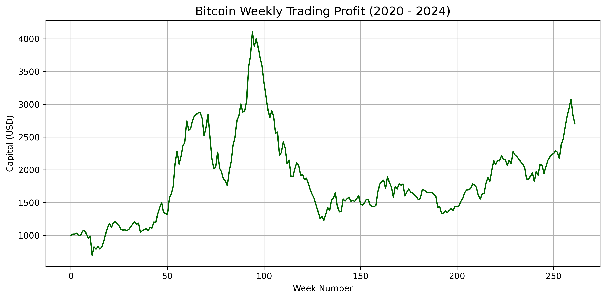
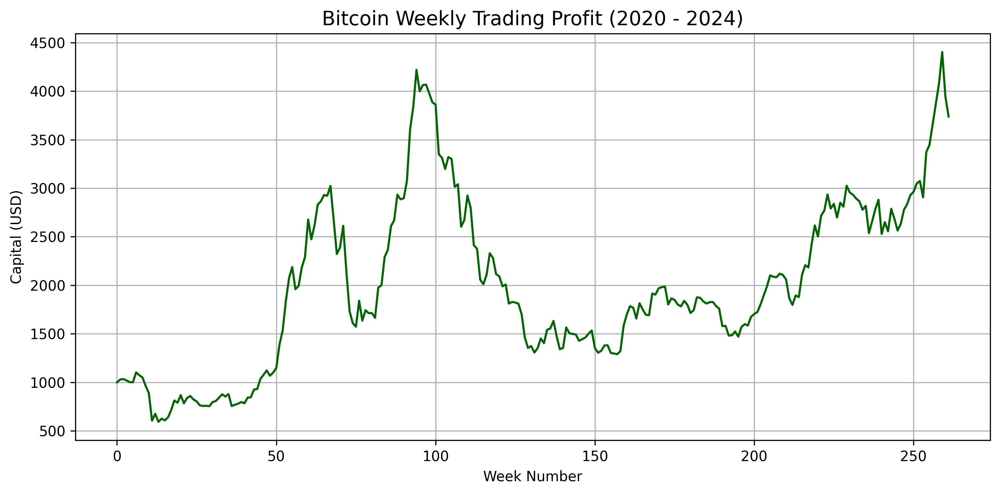

# Bitcoin Strategy Project
This project simulates two investment strategies on Bitcoin from 2020 to 2024 using historical data.

## Dataset
The data is downloaded using "yfinance" with the ticker "BTC-USD"

## Strategies

1. **Fixed Strategy**
   - Buy every Wednesday at Open Price
   - Sell every Friday at Close Price
   - Initial capital: $1000

2. **Optimal Strategy**
   - Dynamically find the best weekday to buy and best weekday to sell
   - Simulate maximum profit scenario based on weekly prices

## Outputs

- python 3.10+
- yfinance
- matplotlib
- pandas

Install packages via pip:
'''bash
pip install yfinance matplotlib pandas

